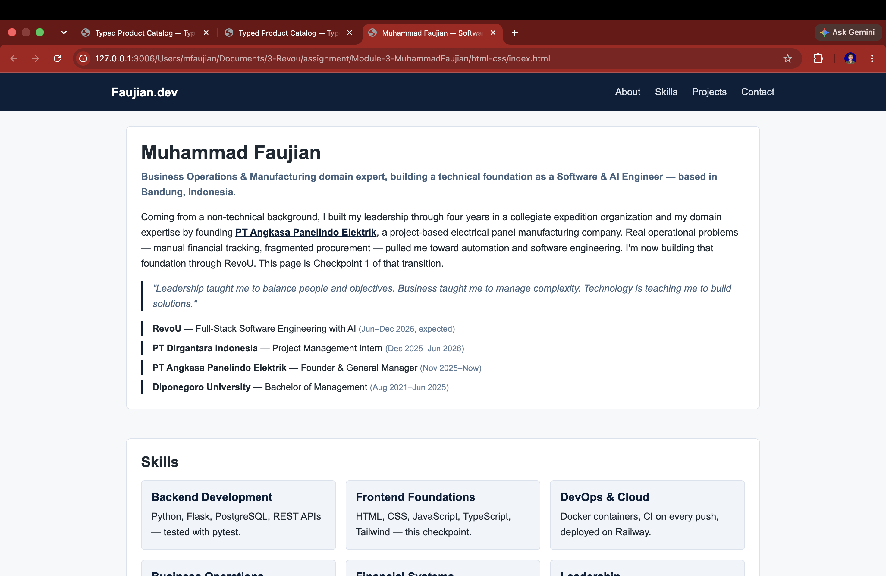
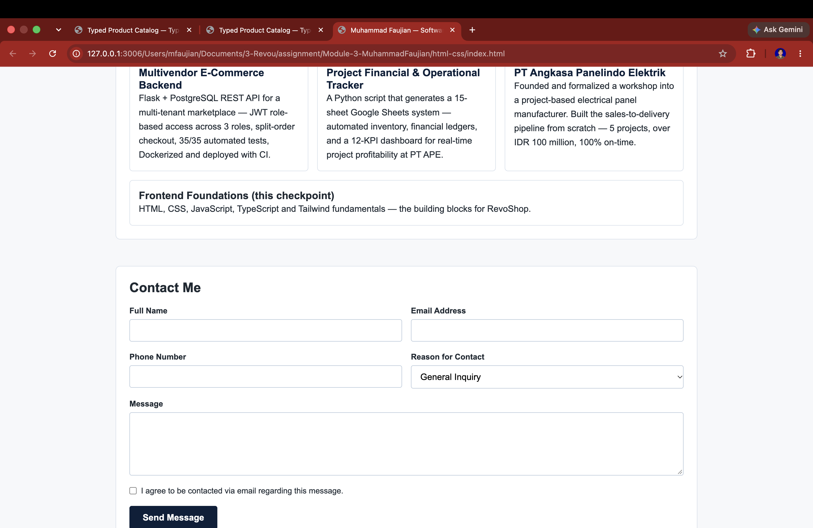
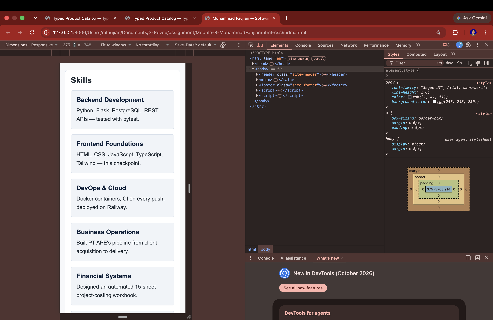
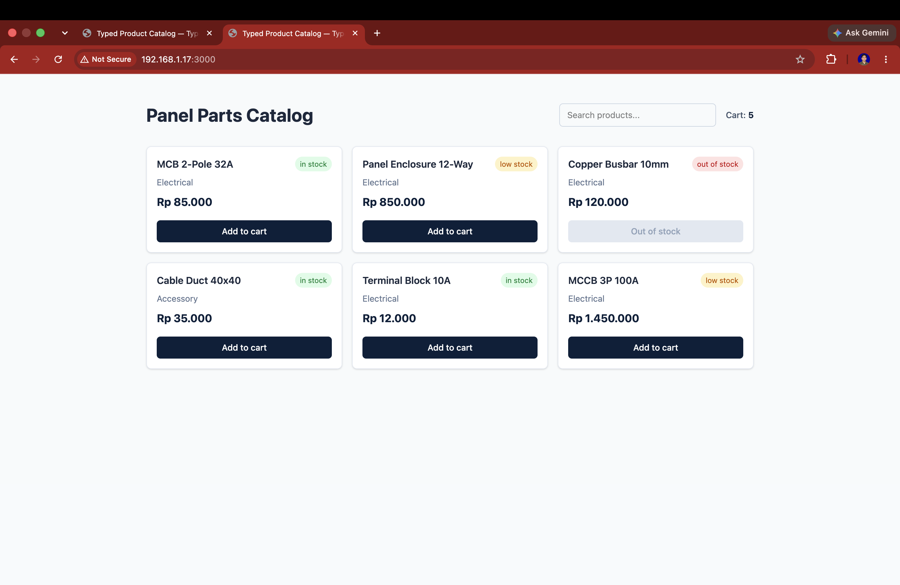

# RevoU Frontend Checkpoint 1 — Frontend Foundations


Muhammad Faujian's Checkpoint 1 submission for RevoU's Full-Stack Software Engineering with AI program: semantic HTML/CSS, vanilla JavaScript, TypeScript, and Tailwind CSS — the building blocks for the RevoShop application in later checkpoints.

## Table of Contents

- [RevoU Frontend Checkpoint 1 — Frontend Foundations](#revou-frontend-checkpoint-1--frontend-foundations)
  - [Table of Contents](#table-of-contents)
  - [Folder Structure](#folder-structure)
  - [1. `html-css/` — Semantic Profile Page](#1-html-css--semantic-profile-page)
  - [2. `javascript/` — Vanilla JS Exercises](#2-javascript--vanilla-js-exercises)
  - [3. `typescript-tailwind/` — Typed Product Catalog](#3-typescript-tailwind--typed-product-catalog)
  - [Prerequisites](#prerequisites)
  - [Screenshots](#screenshots)
    - [Profile page — desktop](#profile-page--desktop)
    - [Profile page — mobile (375px)](#profile-page--mobile-375px)
    - [Product catalog — live search \& Tailwind styling](#product-catalog--live-search--tailwind-styling)
  - [Tech Stack](#tech-stack)
  - [Scope Note](#scope-note)
  - [Author](#author)

## Folder Structure

```
Module-3-MuhammadFaujian/
├── html-css/              Semantic profile page + contact form
├── javascript/             DOM/events + array-processing exercises
├── typescript-tailwind/    Typed, Tailwind-styled interactive product catalog
├── .gitignore
└── README.md
```

## 1. `html-css/` — Semantic Profile Page

`index.html`, `styles.css`. A personal profile page demonstrating:

- Semantic HTML5 elements (`header`, `main`, `section`, `article`, `footer`) instead of generic `div`s
- A contact form with varied input types (text, email, tel, select, textarea, checkbox), each with an associated `<label for>`
- CSS selectors (element, class, descendant, pseudo-class) and correct use of the box model (margin, border, padding)
- A two-dimensional layout built with CSS Grid (`.skills-grid`)
- Responsive breakpoints at 768px and 480px, verified at mobile width

**Run it:** open `html-css/index.html` directly in a browser. No dependencies, no build step.

## 2. `javascript/` — Vanilla JS Exercises

Three independent, standalone exercises — no build tools:

| Files | Demonstrates |
|---|---|
| `basics.html` / `basics.js` | Variable declarations, data types, operators, and functions (an order-total calculator) |
| `dom-events.html` / `dom-events.js` | Selecting/updating the DOM, toggling classes, creating/removing elements, event handling with `preventDefault` (a task list) |
| `array-processing.html` / `array-processing.js` | `forEach`, `map`, `filter`, and `reduce` over an array of objects (an inventory dataset) |

**Run it:** open any of the three `.html` files directly in a browser. Open the browser console to see logged output on `basics.html` and `array-processing.html`.

## 3. `typescript-tailwind/` — Typed Product Catalog

A small TypeScript + Tailwind CSS v4 project demonstrating:

- `tsc` with a correctly configured `tsconfig.json`, compiling without errors
- Interfaces and a type alias modeling product-like data (`src/types.ts`)
- A union type (`Availability`) modeling a value with more than one shape
- Nested typed objects and arrays (`Product[]`, `CartItem`)
- Tailwind CSS installed and configured, styled entirely with utility classes
- Typography and a responsive, mobile-first layout (`sm:`/`lg:` breakpoints)
- A typed field mapped to conditional Tailwind classes (`availabilityBadgeClasses`)
- A fully typed, interactive catalog: renders from typed data, a live search filter, and an add-to-cart counter

Structure:
- `src/types.ts` — interfaces, type alias, union type, modeled on the same `Product`/`Category` shape as the [multivendor-ecommerce-backend](https://github.com/mfaujian/multivendor-ecommerce-backend) database (`sellerId`, `categoryId`, `stock`, `isActive`)
- `src/data.ts` — typed product and category data
- `src/app.ts` — rendering, live search, cart counter, typed→Tailwind class mapping
- `src/input.css` — Tailwind entry point
- `tsconfig.json` / `package.json` — `tsc` and the Tailwind CLI, both compiling into `dist/`

**Run it:**
```bash
cd typescript-tailwind
npm install
npm run build
npx serve .
```
Then open the URL `serve` prints. Opening `index.html` directly won't work — browsers block ES module imports loaded over `file://`.

## Prerequisites

Node.js and npm (already installed if you followed the setup steps in this repo's history). No other runtime is required — `html-css/` and `javascript/` need nothing but a browser.

## Screenshots

### Profile page — desktop



### Profile page — mobile (375px)


### Product catalog — live search & Tailwind styling


## Tech Stack

HTML5 · CSS3 (Grid, Flexbox, media queries) · vanilla JavaScript (ES6+) · TypeScript 5 · Tailwind CSS v4

## Scope Note

This checkpoint intentionally does not integrate with the `multivendor-ecommerce-backend` repository — per the assignment scope, that integration begins in Checkpoint 2 with Next.js.

## Author

**Muhammad Faujian** — [GitHub](https://github.com/mfaujian)